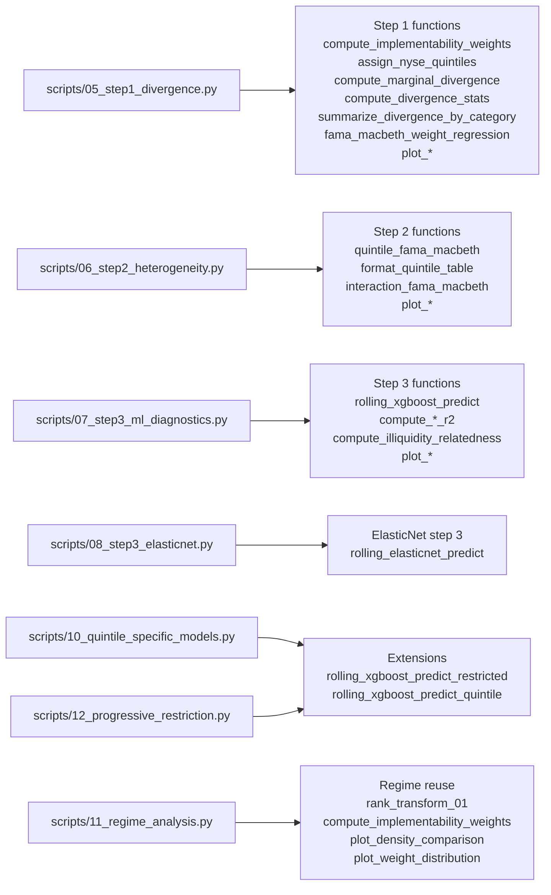

# `src/analysis/motivation.py` Function Map

This document is a function-by-function map of [motivation.py](/Users/tengjiao/Desktop/PhD-Y3/Liquidity/liquidity_ml/src/analysis/motivation.py).

Use it when you want to understand:

- what each function in the module does
- how the functions are grouped by purpose
- which scripts call which parts of the module
- what order makes sense for reading the file

Companion docs:
- [project_code_walkthrough.md](/Users/tengjiao/Desktop/PhD-Y3/Liquidity/liquidity_ml/docs/project_code_walkthrough.md)
- [project_data_flow.md](/Users/tengjiao/Desktop/PhD-Y3/Liquidity/liquidity_ml/docs/project_data_flow.md)

## 1. What This Module Is

`src/analysis/motivation.py` is the shared library behind the motivation section.

It does five main jobs:

1. defines the focal characteristics and category mappings
2. prepares motivation-specific feature sets and liquidity labels
3. implements Step 1 divergence analysis
4. implements Step 2 heterogeneity analysis
5. implements Step 3 rolling-ML diagnostics and its extensions

## 2. Full Function Map

```mermaid
flowchart TD
    subgraph A["Constants and metadata"]
        fc["FOCAL_CHARACTERISTICS"]
        dpf["DENSITY_PLOT_FEATURES"]
        ctb["CZ_TO_BROAD"]
    end

    subgraph B["Data preparation"]
        lsd["load_signaldoc"]
        gmf["get_motivation_features"]
        lfc["load_feature_categories"]
        bfc["build_feature_categories"]
        rt["rank_transform_01"]
        ciw["compute_implementability_weights"]
        anq["assign_nyse_quintiles"]
    end

    subgraph C["Step 1 core computations"]
        cmd["compute_marginal_divergence"]
        cds["compute_divergence_stats"]
        sdc["summarize_divergence_by_category"]
        fmw["fama_macbeth_weight_regression"]
    end

    subgraph D["Plot styling helpers"]
        sas["_set_academic_style"]
        ca["_clean_axes"]
    end

    subgraph E["Step 1 plotting"]
        pdbc["plot_divergence_bar_chart"]
        pdbcat["plot_divergence_by_category"]
        pdc["plot_density_comparison"]
        pwd["plot_weight_distribution"]
    end

    subgraph F["Step 2 estimation"]
        qfm["quintile_fama_macbeth"]
        fqt["format_quintile_table"]
        ifm["interaction_fama_macbeth"]
    end

    subgraph G["Step 2 plotting"]
        pqc["plot_quintile_coefficients"]
        pdvh["plot_divergence_vs_heterogeneity"]
    end

    subgraph H["Step 3 rolling model engines"]
        rxgb["rolling_xgboost_predict"]
        core["_rolling_xgboost_core"]
        rxgbr["rolling_xgboost_predict_restricted"]
        rxgbq["rolling_xgboost_predict_quintile"]
        ren["rolling_elasticnet_predict"]
        exgb["expanding_xgboost_predict"]
        een["expanding_elasticnet_predict"]
    end

    subgraph I["Step 3 diagnostics"]
        ctf["compute_topk_frequency"]
        cira["compute_illiquidity_relatedness_aligned"]
        cir["compute_illiquidity_relatedness"]
        cqor["compute_quintile_oos_r2"]
        cmqr["compute_monthly_quintile_r2"]
        cuwr["compute_utility_weighted_r2"]
        cmuwr["compute_monthly_utility_weighted_r2"]
        culr["compute_univariate_liquid_r2"]
    end

    subgraph J["Step 3 plotting"]
        piv["plot_importance_vs_illiquidity"]
        pvl["plot_importance_vs_liquid_r2"]
        prq["plot_r2_by_quintile"]
    end

    lsd --> gmf
    lsd --> bfc
    ctb --> bfc

    fc --> gmf
    fc --> pdc
    dpf --> pdc

    rt --> cmd
    ciw --> cmd
    anq --> qfm
    anq --> cqor
    anq --> cmqr
    anq --> culr

    cmd --> cds
    cds --> sdc
    cds --> pdbc
    cds --> pdvh
    ciw --> fmw

    sas --> pdbc
    ca --> pdbc
    sas --> pdbcat
    sas --> pdc
    sas --> pwd
    sas --> pqc
    sas --> pdvh
    sas --> piv
    sas --> pvl
    sas --> prq

    qfm --> fqt
    qfm --> pqc
    ifm --> pdvh

    core --> rxgbr
    core --> rxgbq
    rxgb --> ctf
    rxgb --> cqor
    rxgb --> cmqr
    rxgb --> cuwr
    rxgb --> cmuwr

    cira --> cir
    cir --> piv
    culr --> pvl
    cqor --> prq
```

## 3. Which Scripts Call Which Functions

## 4. Function Inventory by Section

### A. Constants and metadata

- `FOCAL_CHARACTERISTICS`
  The named set of focal characteristics used throughout the motivation analyses.

- `DENSITY_PLOT_FEATURES`
  The subset used in the density-comparison plots.

- `CZ_TO_BROAD`
  Maps CZ fine categories to the broad categories used in tables and plots.

### B. Data preparation

- `load_signaldoc`
  Loads `SignalDoc.csv`.

- `get_motivation_features`
  Builds the motivation feature set from `SignalDoc` plus required hand-added variables.

- `load_feature_categories`
  Loads the saved JSON category map.

- `build_feature_categories`
  Builds and saves the JSON category map from `SignalDoc`.

- `rank_transform_01`
  Cross-sectional rank transform to `[0, 1]`.

- `compute_implementability_weights`
  Computes `w_tilde` using the selected liquidity proxy.

- `assign_nyse_quintiles`
  Computes NYSE-breakpoint quintiles month by month.

### C. Step 1 core computations

- `compute_marginal_divergence`
  Computes monthly deploy-minus-train divergence for each feature.

- `compute_divergence_stats`
  Converts monthly divergence series into mean effects and Newey-West inference.

- `summarize_divergence_by_category`
  Aggregates divergence results into broad categories.

- `fama_macbeth_weight_regression`
  Regresses `log(w_tilde)` on features in a monthly FM-style cross-sectional setup.

### D. Plot styling helpers

- `_set_academic_style`
  Shared matplotlib style setup.

- `_clean_axes`
  Small helper for plot cleanup.

### E. Step 1 plotting

- `plot_divergence_bar_chart`
- `plot_divergence_by_category`
- `plot_density_comparison`
- `plot_weight_distribution`

These functions turn Step 1 computations into paper-style figures.

### F. Step 2 estimation

- `quintile_fama_macbeth`
  Estimates feature-return relationships separately inside each liquidity quintile.

- `format_quintile_table`
  Converts the raw quintile coefficients into report-style output.

- `interaction_fama_macbeth`
  Estimates main effects plus liquidity interactions over the full sample.

### G. Step 2 plotting

- `plot_quintile_coefficients`
- `plot_divergence_vs_heterogeneity`

These functions visualize the output of the Step 2 estimation routines.

### H. Step 3 rolling model engines

- `rolling_xgboost_predict`
  Baseline rolling XGBoost engine for Step 3.

- `_rolling_xgboost_core`
  Shared internal core used by restricted and quintile-specific variants.

- `rolling_xgboost_predict_restricted`
  Restricted-universe variant for Step 3d.

- `rolling_xgboost_predict_quintile`
  Quintile-specific variant for Step 3e.

- `rolling_elasticnet_predict`
  ElasticNet rolling counterpart.

- `expanding_xgboost_predict`
- `expanding_elasticnet_predict`
  Expanding-window variants.

### I. Step 3 diagnostics

- `compute_topk_frequency`
  How often a feature appears in top-k importance ranks.

- `compute_illiquidity_relatedness_aligned`
  Aligned version of illiquidity-relatedness scoring.

- `compute_illiquidity_relatedness`
  Measures how strongly a feature tracks illiquidity.

- `compute_quintile_oos_r2`
  Pooled OOS R2 by quintile.

- `compute_monthly_quintile_r2`
  Monthly quintile R2 series.

- `compute_utility_weighted_r2`
  Utility-weighted OOS R2.

- `compute_monthly_utility_weighted_r2`
  Monthly utility-weighted R2 series.

- `compute_univariate_liquid_r2`
  Univariate liquid-stock predictive power per feature.

### J. Step 3 plotting

- `plot_importance_vs_illiquidity`
- `plot_importance_vs_liquid_r2`
- `plot_r2_by_quintile`

These turn the Step 3 diagnostics into report figures.

## 5. Reading Order Inside `motivation.py`

If you want the shortest route to understanding the file, read it in this order:

1. `FOCAL_CHARACTERISTICS`
2. `get_motivation_features`
3. `compute_implementability_weights`
4. `assign_nyse_quintiles`
5. `compute_marginal_divergence`
6. `fama_macbeth_weight_regression`
7. `quintile_fama_macbeth`
8. `interaction_fama_macbeth`
9. `rolling_xgboost_predict`
10. `_rolling_xgboost_core`
11. `compute_quintile_oos_r2`
12. `compute_utility_weighted_r2`
13. the plotting functions you care about

That order gives you the economics first and the plotting last.

## 6. Best Way To Use This Map

When reading `motivation.py`, keep three questions in mind for each function:

1. Is this a data-prep helper, an estimator, or a plotter?
2. Which script calls it?
3. Does it feed Step 1, Step 2, or Step 3?

If you label the functions that way as you read, the module becomes much easier to navigate because it stops feeling like one long file and starts feeling like a small library with clear sections.
