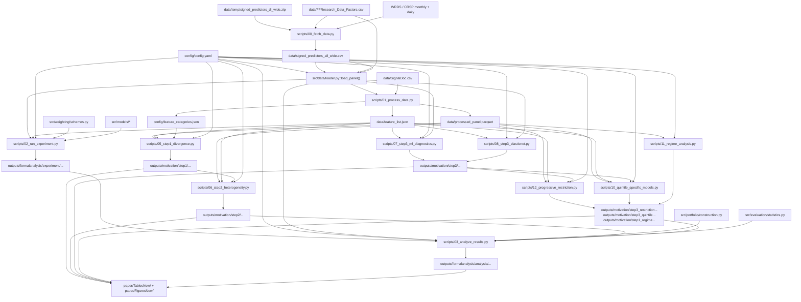
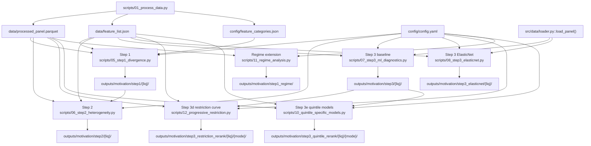
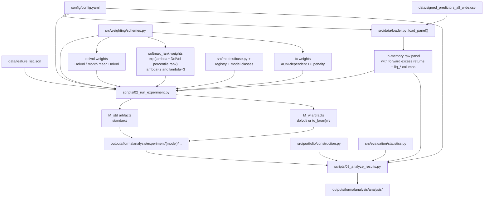

# LiquidityML Data Flow

This document is a visual map of how data moves through the repository.

Use it together with [project_code_walkthrough.md](/Users/tengjiao/Desktop/PhD-Y3/Liquidity/liquidity_ml/docs/project_code_walkthrough.md):

- this file answers: "where does data go next?"
- the walkthrough answers: "which code should I read, and in what order?"
- the motivation-only function map is in [motivation_module_flow.md](/Users/tengjiao/Desktop/PhD-Y3/Liquidity/liquidity_ml/docs/motivation_module_flow.md)
- the exact run commands are in [run_order_cheat_sheet.md](/Users/tengjiao/Desktop/PhD-Y3/Liquidity/liquidity_ml/docs/run_order_cheat_sheet.md)

## 1. End-to-End Flow

## 2. Motivation Pipeline Flow

## 3. Formal Experiment Flow

Weighting note:
- `dolvol` is computed as `DolVol_it / mean_i(DolVol_it)` within each `yyyymm`.
- The mean denominator keeps the average sample weight equal to 1 inside every month.
- `softmax_rank` is computed from the within-month percentile rank of `DolVol`, then mean-normalized. The formal grid now runs lambda 2 and lambda 3 as separate output folders.
- `tc` weights are separate from `dolvol`; they use transaction-cost inputs and require an AUM scenario.
- Current `tc` weights use `alpha_t = 3.0 / median_i(TC_it)`, then normalize weights to mean 1 within month.

## 4. What Each Stage Produces

### Stage A. Raw data assembly

- `scripts/00_fetch_data.py`
- Produces:
  - `data/signed_predictors_all_wide.csv`

This is the raw master panel.

### Stage B. Processed motivation panel

- `scripts/01_process_data.py`
- Produces:
  - `data/processed_panel.parquet`
  - `data/feature_list.json`
  - `config/feature_categories.json`

This is the main entry point for motivation Steps 1 and 2.

### Stage C. Motivation evidence

- `scripts/05_step1_divergence.py`
  - distribution mismatch outputs

- `scripts/06_step2_heterogeneity.py`
  - heterogeneous-predictability outputs
  - with `--full`, also writes the Step 2 files used later by formal Prediction 2

- `scripts/07_step3_ml_diagnostics.py`
  - baseline XGBoost diagnostics

- `scripts/08_step3_elasticnet.py`
  - linear benchmark version of Step 3

- `scripts/12_progressive_restriction.py`
  - restriction-curve comparison
  - its baseline output is reused later by formal Prediction 3

- `scripts/10_quintile_specific_models.py`
  - quintile-specific model comparison

- `scripts/11_regime_analysis.py`
  - regime-specific distribution plots

### Stage D. Formal experiment

- `scripts/02_run_experiment.py`
  - trains standard and weighted models
  - writes predictions and importance files

- `scripts/03_analyze_results.py`
  - consumes those experiment files
  - also consumes Step 2 full outputs and Step 3d baseline restriction outputs
  - writes formal tables and figures

## 5. How To Follow One Observation Through the System

Think of one stock-month observation as moving through these transformations:

1. It is created in the raw merged panel by `scripts/00_fetch_data.py`.
2. `src/data/loader.py` loads it and shifts its return forward so month `t` characteristics predict month `t+1` return.
3. In the motivation branch:
   - `scripts/01_process_data.py` rank-transforms its features into the processed panel.
   - Step 1 compares how much this kind of observation matters under equal-weighted versus implementability-weighted distributions.
   - Step 2 studies whether its feature-return relationship differs by liquidity group.
   - Step 3 tests how well baseline ML predicts it.
4. In the formal branch:
   - `scripts/02_run_experiment.py` may assign it a training weight.
   - one of the model classes uses it in rolling estimation
   - the resulting prediction is written to experiment output
   - `scripts/03_analyze_results.py` may then use that prediction in quintile R2 analysis, Prediction 3 restriction-curve comparison, and portfolio formation

## 6. Best Way To Use This Diagram

If you are reading the project for the first time, I recommend this sequence:

1. Open [project_code_walkthrough.md](/Users/tengjiao/Desktop/PhD-Y3/Liquidity/liquidity_ml/docs/project_code_walkthrough.md).
2. Keep this flowchart open beside it.
3. As you read each script, check:
   - what files it reads
   - what files it writes
   - whether it belongs to the motivation branch or the formal branch

If you do that, the codebase becomes much easier to navigate because each file stops feeling isolated.
